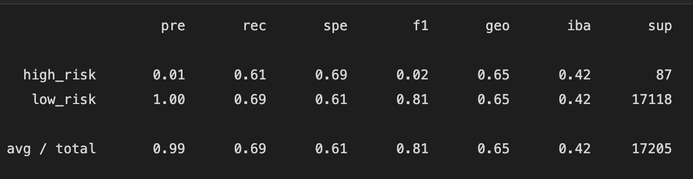
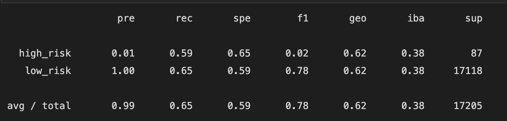
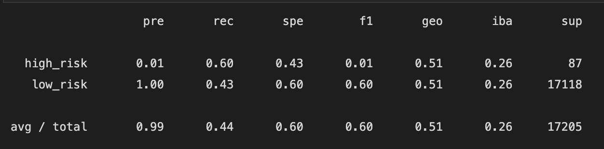
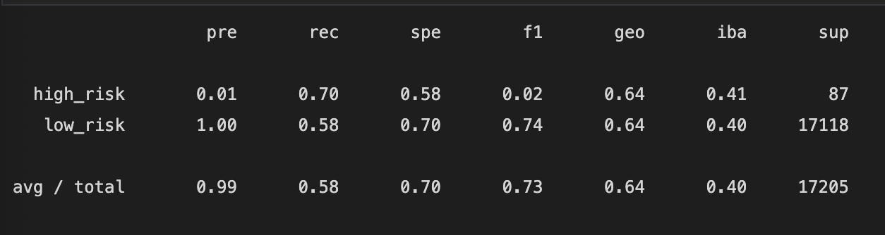
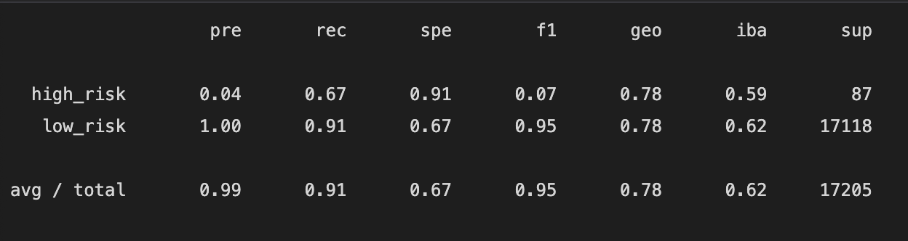
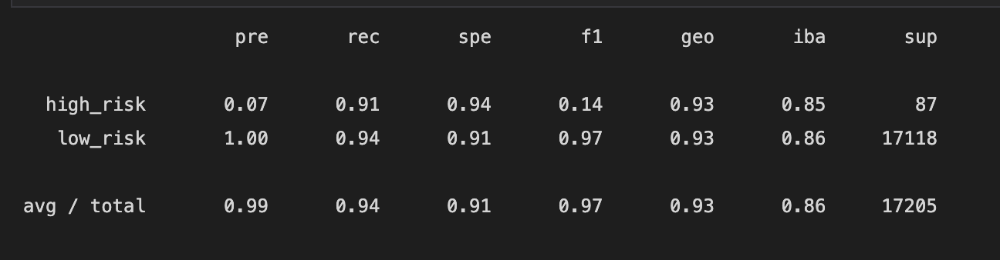

# Credit_Risk_Analysis

# Overview of the loan prediction risk analysis:
## Purpose of this analysis 
The goal of this analysis is to evaluate the performance of machine learning models and make a written recommendation on whether they should be used to predict credit risk.  Using the credit card credit dataset from LendingClub, a peer-to-peer lending services company, I will build and evaluate 6 models.

## Results:
* Naive Random Oversampling
Balanced Accuracy Score: 65%
Precision Score: 99%
Recall Score: 69%

* SMOTE Oversampling
Balanced Accuracy Score: 62%
Precision Score: 99%
Recall Score: 65%

* Undersampling
Balanced Accuracy Score: 52%
Precision Score: 99%
Recall Score: 44%

* Combination (Over and Under) Sampling
Balanced Accuracy Score: 64%
Precision Score: 99%
Recall Score: 58%

* Balanced Random Forest Classifier
Balanced Accuracy Score: 79%
Precision Score: 99%
Recall Score: 91%

* Easy Ensemble AdaBoost Classifier
Balanced Accuracy Score: 93%
Precision Score: 99%
Recall Score: 94%

## Summary:
The Ensemble AdaBoost Classifier had the highest balanced accuracy score as well as recall score making it an easy choice for the best model to use for futute credit card analysis.  The Ensemble Adaboost was followed by Balanced Random Forest Classifier as the next next best model. It is pretty clear that of all the models undersampling performed the worst.

